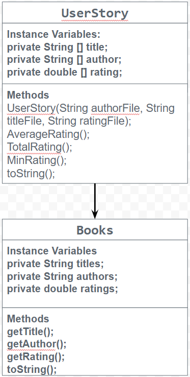

# Unit 3 Data for Social Good Project

 Introduction

Software engineers develop programs to work with data and provide information to a user. Each user has different needs based on the information they are looking for from data. Your goal is to create a data analysis program for your user that stores and analyzes data to provide the information they need.

## Requirements

Use your knowledge of object-oriented programming, one-dimensional (1D) arrays, and algorithms to create your data analysis program:
- **Write a class** – Write a class to represent your user or business and store and analyze their data with no-argument and parameterized constructors.
- **Create at least two 1D arrays** – Create at least two 1D arrays to store the data that your user needs information about.
- **Write a method** – Write a method that finds or manipulates the elements in a 1D array to provide the information your user needs.
- **Implement a toString() method** – Write a toString() method that returns general information about the data (for example, number of values in the dataset).
- **Document your code** – Use comments to explain the purpose of the methods and code segments and note any preconditions and postconditions.

## User Story 

> As a book enthusiast,
> I want to promote highly rated books, 
> so that people become interested in reading more books, helping with the issue of libraries and book stores closing.

## Dataset 

Dataset: https://www.kaggle.com/datasets/valakhorasani/best-books-of-the-decade-2020s
- **Book Name** (String) - the title of the books
- **Author** (String) - the authors who wrote each book
- **Rating** (double) - the rating of books on a 1-5 scale 

## UML Diagram 

Put an image of your UML Diagram here. Upload the image of your UML Diagram to your repository, then use the Markdown syntax to insert your image here. Make sure your image file name is one work, otherwise it might not properly get displayed on this README. 

 

## Description 

Our user story starts with a book data set. As book enthusiasts, Bella and I wanted to promote and bring awareness to the closing of libraries and book stores, which is a major issue in today's society. Our code implements text files, which transverse data instead of an initializer list, using a nested loop to help fellow readers determine what books to read next. We coded a method called minRating, which has a condition within the nested loop. The method increases the index every time the loop is run. As a result, readers can find books with a rating of 4.20 or higher, which are printed into the console with a print statement. In addtion, we coded two additional methods, TotalRating() and Average Rating. These two methods endabled us to take the values of ratings and find the average; the other method, TotalRating assisted the AvergeRating method to calculate the average.